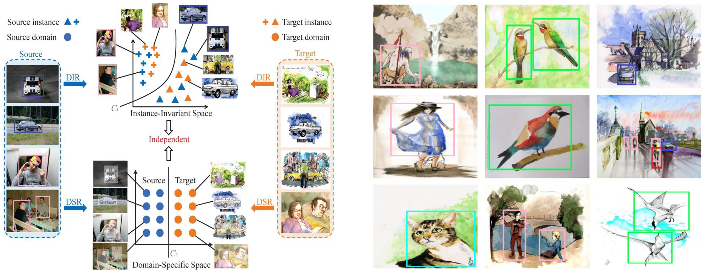

# Progressive Disentanglement for DAOD

This is the implementation of our paper [Instance-Invariant Domain Adaptive Object Detection via Progressive Disentanglement](https://arxiv.org/abs/1911.08712) that has been accepted to IEEE Transactions on Pattern Analysis and Machine Intelligence (TPAMI).

## Introduction
For the problem of domain adaptive object detection, it is important to obtain the instance-invariant features that are domain-invariant. To this end, this paper proposes a progressive disentangled framework to disentangle the domain-invariant features from the domain-specific features. 
